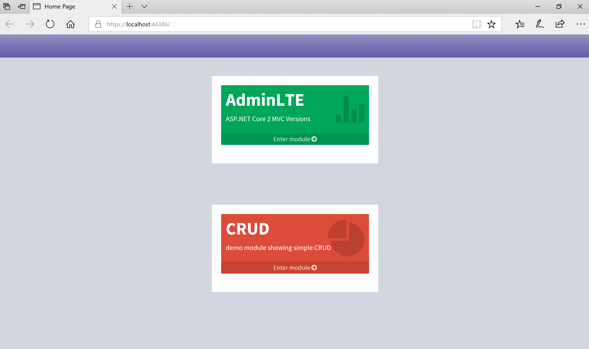
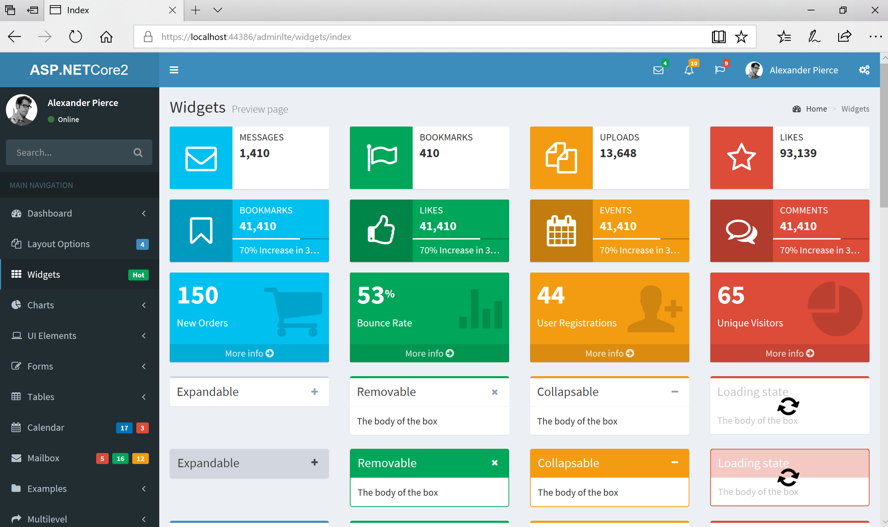
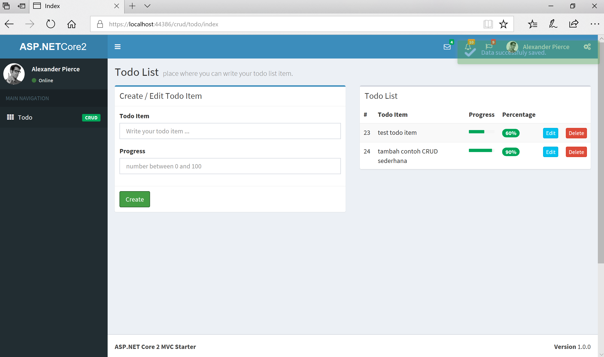

# AdminLTE

AdminLTE - is a Free Premium Admin control Panel Theme Based On Bootstrap 3.x

the creator of AdminLTE is [Abdulllah Almsaeed](https://adminlte.io/about)

follow this [AdminLTE](https://github.com/almasaeed2010/AdminLTE) link for original HTML/JavaScript version.

# ASP.NET Core 2 MVC Version

this repo, provide full **ASP.NET Core 2 MVC** version of AdminLTE, consisting all the demo pages provided by HTML/JavaScript version of AdminLTE such as:

- Dashboard
- Layout
- Widgets
- Charts
- UI Elements
- Forms
- Tables
- Calendar
- Mailbox
- Examples
- Multilevel

![adminltemvccore2](src/src/wwwroot/adminlte/img/adminlte-aspnetcore2-p2.PNG

# Development Tools & Environment

I'm using **Visual Studio Community 2017** for the development tools on Windows 10 machine. For this project, i'm using AdminLTE version **2.4.0**.

# AdminLTE ASP.NET Core 2 MVC Version Usage

You can **Clone / Download** the repo and then start building beautiful web app using this visual studio solution. From this project you can also learn how to:

- work with controller
- work with view
- work with partial view
- work with layout
- work with JavaScript / jQuery
- work with razor
- create HTML helper extension

# Simple CRUD Example

I have provide simple Ajax jQuery CRUD example

